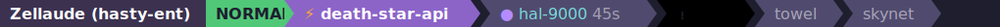

# Zellaude

A Zellij status bar plugin that replaces the default tab bar with Claude Code activity awareness.



## Features

- **Full tab bar** — shows all Zellij tabs (not just Claude sessions), replacing the native tab bar
- **Session & mode display** — shows the Zellij session name and current input mode (NORMAL, LOCKED, PANE, etc.) with color-coded indicators
- **Live activity indicators** — see what every Claude Code session is doing at a glance; non-Claude tabs shown dimly
- **Clickable tabs** — click any tab to switch to it
- **Smart pane focus** — clicking a waiting (⚠) session focuses the exact pane so you can respond to the permission prompt immediately
- **Permission flash** — sessions pulse bright yellow for 2 seconds when a permission request arrives
- **Desktop notifications** — macOS notification on permission requests (rate-limited to once per 10s per tab), with click-to-focus support via [terminal-notifier](https://github.com/julienXX/terminal-notifier)
- **Elapsed time** — shows how long a session has been in its current state (after 30s), making it easy to spot stuck sessions
- **Multi-instance sync** — all Zellij tabs show a unified view of all sessions

### Activity symbols

| Symbol | Meaning |
|--------|---------|
| $\color{#b4afc3}{◆}$ | Session starting |
| $\color{#b48cff}{●}$ | Thinking |
| $\color{#ffaa32}{⚡}$ | Running Bash |
| $\color{#ffaa32}{◉}$ | Reading / searching files |
| $\color{#ffaa32}{✎}$ | Editing / writing files |
| $\color{#ffaa32}{⊜}$ | Spawning subagent |
| $\color{#ffaa32}{◈}$ | Web search / fetch |
| $\color{#ffaa32}{⚙}$ | Other tool |
| $\color{#50c878}{▶}$ | Waiting for user prompt |
| $\color{#ff3c3c}{⚠}$ | Waiting for permission |
| $\color{#50c878}{✓}$ | Done |
| $\color{#b4afc3}{○}$ | Idle |

### Settings

Click the **Zellaude** prefix on the left side of the bar to open the settings menu. Click it again (or the `×` button) to close. Settings are persisted to `~/.config/zellij/plugins/zellaude.json`.

| Setting | Options | Default | Description |
|---------|---------|---------|-------------|
| Notifications | Always / Unfocused / Off | Always | Desktop notifications on permission requests. "Unfocused" only notifies when the requesting pane is on a different tab. |
| Flash | Persist / Brief / Off | Brief | Yellow flash on permission requests. "Persist" keeps flashing until resolved, "Brief" flashes for 2 seconds. |
| Elapsed time | On / Off | On | Show time since last activity (appears after 30s). |

## Install

### Quick install

Add the plugin directly to your Zellij layout — no build step required:

```kdl
default_tab_template {
    pane size=1 borderless=true {
        plugin location="https://github.com/ishefi/zellaude/releases/latest/download/zellaude.wasm"
    }
    children
}
```

Then register the Claude Code hooks (requires [jq](https://jqlang.github.io/jq/)):

```bash
git clone https://github.com/ishefi/zellaude.git /tmp/zellaude
/tmp/zellaude/scripts/install-hooks.sh
```

### Build from source

Prerequisites: [Rust](https://rustup.rs), [jq](https://jqlang.github.io/jq/), [Zellij](https://zellij.dev)

```bash
git clone https://github.com/ishefi/zellaude.git
cd zellaude
./install.sh
```

This builds the WASM plugin, copies it to `~/.config/zellij/plugins/`, and registers Claude Code hooks.

Then add the plugin to your Zellij layout (replaces the default tab bar):

```kdl
default_tab_template {
    pane size=1 borderless=true {
        plugin location="file:~/.config/zellij/plugins/zellaude.wasm"
    }
    children
}
```

Or try the included layout directly:

```bash
zellij --layout layout.kdl
```

### Optional: click-to-focus notifications

For desktop notifications that focus the right pane when clicked, install [terminal-notifier](https://github.com/julienXX/terminal-notifier):

```bash
brew install terminal-notifier
```

Without it, notifications still appear via osascript but clicking them won't focus the pane.

## Uninstall

```bash
./install.sh --uninstall
```

## How it works

Two components:

1. **WASM plugin** — runs inside Zellij, receives events, maintains state in memory, renders the status bar, sends desktop notifications
2. **Hook script** — a thin bash bridge that forwards Claude Code hook events to the plugin via `zellij pipe`

```
Claude Code hook → zellaude-hook.sh → zellij pipe → plugin → render
```

All state lives in WASM memory. No temp files, no race conditions. Multiple plugin instances (one per tab) sync state automatically via inter-plugin messaging. Sessions are cleaned up automatically when tabs are closed.

## License

MIT
